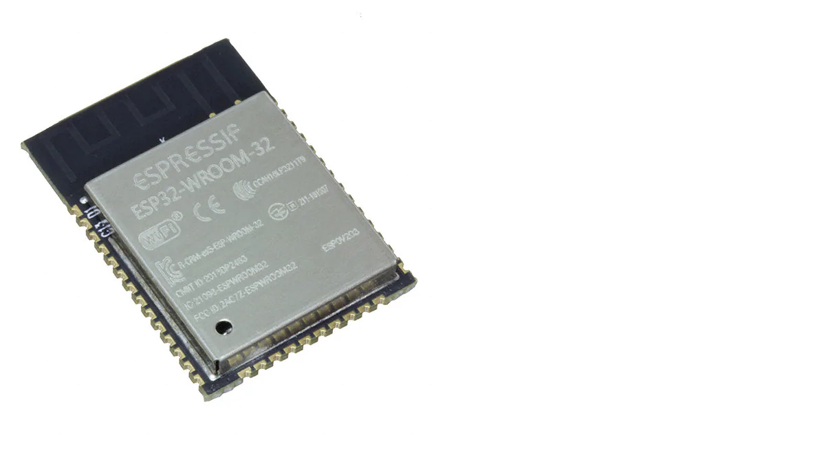
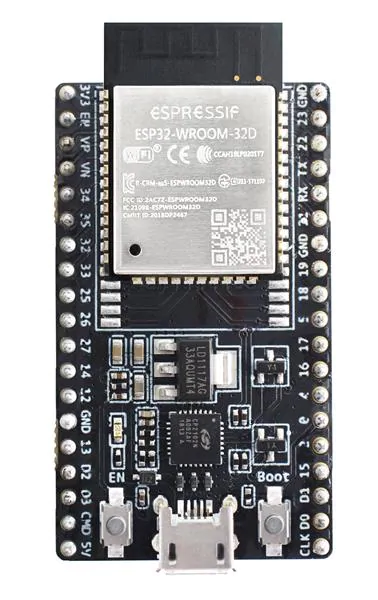
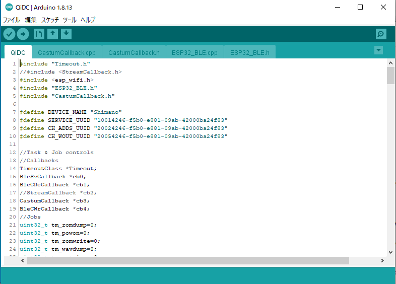
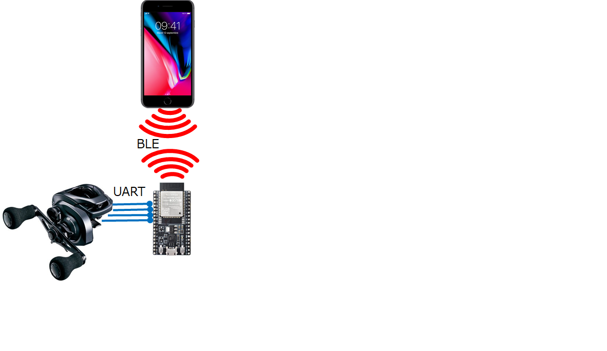

# ESP32の研究  
### ■■ESP32とは

ESP32シリーズは 上海Espressif社が供給するSoC。図はESP32-WROOM-32という品種。

主なスペック
- 外寸: 26&times;18&times;3
- メインプロセッサ: Xtensa(ARM)デュアルコア32ビット 最大クロック240MHz
- メインメモリー: 520KiB **Static**RAM
- フラッシュメモリ: 2～8MB
- 無線接続: Wi-Fi、BLE
- 有線接続: UART&times;3

実売価格は、チップで\700～800、開発ボード(後述)で\1000～2000。チップは上海だと\200程度らしい。
 

### ■■開発ボード  

まずはやってみよう！という人のために開発ボードが多種販売されている。これを入手すればArduinoみたいにUSBケーブル1本で動かしてみれる。
 

### ■■開発環境  

ArduinoIDEが使える(!)。既に在るものを利用する、という思想は大いに参考にしないといけない(何故だか日本人は０から作りたがる)。

おきまりの*setup*～*loop*というとこにコードを埋めるだけ。
~~~
setup(){

}
loop(){

}
~~~
 

### ■■ここまでのまとめ  
- Arduinoを使うみたいに、はるかに高性能のSoCが使える
- その上、只でPCやスマホとWifi or BLE接続できる
- このスペックでしかも激安(Arduinoの1/3)
ということで、Arduinoはもう終了ですね(IDEは使えます)。
 

## ■何か作ってみよう  
### ■■DCリール無線ゲートウェイ  

DCリールに接続して
- スマホからパラメータ変更
- 投擲時データの採取
ができるIoTデバイスを作ってみる。ゆくゆくはリールに内蔵しよう(もう少し小型化、低電流化が要りそうだが)。
 

### ■■つまづいたこと  
- 排他制御  
Arduinoで作っていたシングルスレッドのイベントスケジューラhttps://github.com/KazukiHiraizumi/Arduino/tree/master/libraries/Timeout を使っていたが、何か動作がおかしい？
  - 削除したはずのイベントハンドラが実行される
  - イベントハンドラの途中に別のハンドラが割り込んでくる

- word型のbyteサイズ
  - Exceptionで落ちる
  - Endian変更したら０になる

### ■■FreeRTOS  
どうやらこのボード、FreeRTOSというもので実装されている。FreeRTOSはAmazonが推しているIoTデバイス用のRTOS(リアルタイムOS)だったのですね。
で、Arduinoでおなじみのsetup～loopもFreeRTOSのタスクのひとつとして実装されている。
~~~
void loopTask(void *pvParameters)
{
    setup();
    for(;;) {
        if(loopTaskWDTEnabled){
            esp_task_wdt_reset();
        }
        loop();
        if (serialEventRun) serialEventRun();
    }
}

extern "C" void app_main()
{
    loopTaskWDTEnabled = false;
    initArduino();
    xTaskCreateUniversal(loopTask, "loopTask", CONFIG_ARDUINO_LOOP_STACK_SIZE, NULL, 1, &loopTaskHandle, CONFIG_ARDUINO_RUNNING_CORE);
}
~~~
またI/Oイベントはコールバック駆動になっていて、とても使い易いが、loopとは別スレッド(別コア)なので排他制御は必須。
排他制御の実装はMutexのTake～Giveで行います。
~~~
  const TickType_t xTicksToWait=1000UL;
  BaseType_t xStatus = xSemaphoreTake(xMutex, xTicksToWait);
  ～誰かにリソースを変更されたらマズイ箇所～
  xSemaphoreGive(xMutex);
~~~
FreeRTOSはマルチスレッド制御以外に、コアへのスレッドの割り当て、もやってくれます。

もうArduinoとは全く別物。

### ■■変数サイズ  
Arduino(ATMEL)のWORD型は16ビットですが、ESP32は32ビットです。注意しましょう。バイト幅をきちんと指定したいときは
*[u]intNN_t*とかを指定した方がいいかも。

### ■■無名関数  
ESP32には関係ないが、C++でも無名関数が使えるようになっていました。コールバックのコードがキレイに書けます。ただし変数スコープは注意が必要。以下のコードでは変数varをコールバック内で参照する場合は、varのスコープが::(global)か
staticでないとエラーになります。
~~~
int var;
Timeout->set( {
  ～50ms後に実行されるコード～
},50);
~~~

## ■■まとめ  
Arduinoから始まった、シロウトが作る組込みコンピュータの世界が、本物になっていました。OS無しの世界でマルチコアのCPUをどうやって使いこなすのかと思っていましたが、FreeRTOSが答だった。RasPIがRasPI-PicoでLinuxを捨てたのもこういう背景があったのかも。Amazonの戦略も楽しい。

# 参考ページ
- ESP32 Getting Started  
https://dl.espressif.com/dl/package_esp32_index.json
- FreeRTOS  
https://aws.amazon.com/jp/freertos/