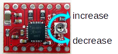

# 起動手順  
1. Arduino(Lenardo)にUSBケーブルが接続されていれば、それを外します
2. 電源プラグにコードを差し込み、電源SWをオン
3. Arduino(Leonardo)のLED(L)の点滅開始します。点滅終了で起動完了

# 調整  
## ソフトウェア
Arduinoプログラムのマクロ(#define)にて、以下の調整が出来ます。

|機能|マクロ名|調整方法|
|:----|:----|:----|
|ハンドル回転方向|INVERT|true:右ハンドル false:左ハンドル|
|ギア比(ウォーム:ハンドル)|RATIO|ギア比(ウォームシャフト:ハンドル)を8ビット範囲(0〜255)で設定します。実際のギア比は**RATIO/256**となります。1を設定したい場合は、RATIOを0とします。なお1を超えるギア比は設定出来できません。|

## A4988(ステッピングモータドライバ)  
下図のトリマーにて電流調整します。モータ(TS3692)の定格電流は300mAです。  

# BOM

|部品名|個数|仕様・型式|製造者|
|:----|:----|:----|:----|
|ステッピングモータ|1|200div/rev・TS3692N65|多摩川精機|
|ロータリエンコーダ|1|100p/rev・REL18-100BP|アルファ|
|モータマウント|1|3D-Print||
|モータドライバ|1|A4988|Polulu他|
|マイコン|1|Arduino Leonardo|Arduino|
|ドーターボード|1|UB-ARD01|Sunhayato|
|電源プラグ|1|EIAJ-3(メス)||
|電解コンデンサ|1|220&micro;F||
